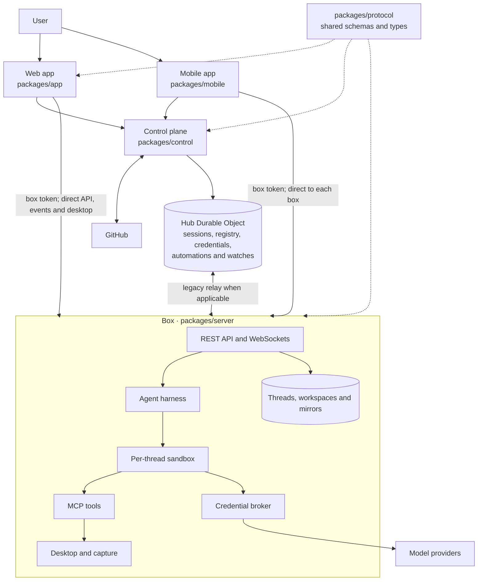

# Kestrel architecture

This document describes the system as implemented today: its components, data flows and trust boundaries. The intended evolution, including The Nest's per-user VMs and saved evidence, is described separately in [goal-state.md](goal-state.md). A goal or proposal there is not a claim that it is already implemented. See [box.md](box.md) for box operations and sandbox details, and [byo-box.md](byo-box.md) for bringing your own box.

## System overview

Kestrel has an interface for interacting with agents and viewing their desktops, and boxes that run the work. A box may be operated by Kestrel or supplied by a user. The control plane signs users in, coordinates access to boxes and handles shared services. Today Kestrel-operated managed boxes can serve multiple users; the goal is a separate Nest VM per user on a shared host.

```mermaid
flowchart TB
  U["User"] --> WEB["Web app<br/>packages/app"]
  U --> MOBILE["Mobile app<br/>packages/mobile"]
  WEB --> CTRL["Control plane<br/>packages/control"]
  MOBILE --> CTRL
  CTRL <--> GH["GitHub"]
  CTRL --> HUB[("Hub Durable Object<br/>sessions, registry, credentials,<br/>automations and watches")]
  WEB -->|"box token; direct API, events and desktop"| BOX
  MOBILE -->|"box token; direct to each box"| BOX
  HUB <-->|"legacy relay when applicable"| BOX
  subgraph BOX["Box · packages/server"]
    API["REST API and WebSockets"]
    HARNESS["Agent harness"]
    SANDBOX["Per-thread sandbox"]
    MCP["MCP tools"]
    BROKER["Credential broker"]
    DESKTOP["Desktop and capture"]
    DATA[("Threads, workspaces and mirrors")]
    API --> HARNESS --> SANDBOX
    API --> DATA
    SANDBOX --> MCP
    SANDBOX --> BROKER
    MCP --> DESKTOP
  end
  BROKER --> MODEL["Model providers"]
  PROTOCOL["packages/protocol<br/>shared schemas and types"] -.-> WEB
  PROTOCOL -.-> CTRL
  PROTOCOL -.-> BOX
```

The diagram shows the major paths, not every endpoint. The legacy relay remains for users without a managed or directly connected box. Desktop signaling and status, and preview traffic, can also use it; desktop video, audio and input never do. Protocol schemas are shared across packages; changes to them affect all consumers.

## Components

| Component | Responsibility | Location |
|---|---|---|
| Web interface | Public pages, authenticated workspace, thread and desktop views | `packages/app` |
| Mobile interface | Multi-box thread lists and box-scoped thread and desktop access | `packages/mobile` |
| Shared composer | GitHub reference format, draft parsing and the DOM editor used by desktop, phone web and Expo native WebViews | `packages/composer` |
| Shared UI | Theme tokens, primitives, the chat transcript and panels (quotas) rendered by desktop, phone web and Expo native WebViews | `packages/ui` |
| Control plane | GitHub OAuth, sessions, box registration and tokens, credentials, automations, PR watches and relay | `packages/control` |
| Hub | Durable control-plane state and coordination, including fleet registry and scheduled events | `packages/control/src/hub.ts` |
| Box | Thread API, agent runs, workspaces, sandbox, desktop and tools | `packages/server` |
| Host experiment | Local per-user CPU VM lifecycle CLI; not yet the Nest host agent | `packages/host` |
| Shared protocol | Schemas and types for APIs, events, relay and domain objects | `packages/protocol` |

Phone browsers use the mobile app's web export. Its reference composer and the desktop composer share one DOM
implementation; Expo bundles that surface locally for native iOS/Android through `use dom`. References serialize
as ordinary GitHub Markdown links with explicit repository, kind and number, so drafts and messages cross UI
surfaces without a protocol change. See [mobile references](../packages/mobile/README.md#github-references).

Shared panels follow the same pattern: `packages/ui` holds the DOM component with plain JSON props, each app
fetches the data with its own client, and the phone app renders the component through a `use dom` wrapper whose
Tailwind comes from `@cloudagents/ui/dom.css` (Metro runs `@tailwindcss/postcss`). See
[shared desktop components](../packages/mobile/README.md#shared-desktop-components). The chat transcript is one such
component: the phone app keeps the thread in its query cache and sends the DOM side a snapshot, then only what changed.

## Access and communication

The Worker serves the web app and public site, handles sign-in, and issues box-scoped tokens. Direct clients use each box's URL; the box verifies its token offline. The web app can send eligible API calls over a WebRTC data channel after signaling directly to the box, with HTTP fallback; mobile, events, uploads and previews use their existing HTTP or WebSocket paths. Desktop video, audio and input use WebRTC only, signaled over the desktop WebSocket (direct, or through the legacy relay); there is no WebSocket media fallback. Both apps list threads across boxes and route a thread's requests to its box. See [byo-box.md](byo-box.md) for connection setup and direct-path limits.

The Hub also maintains a legacy WebSocket relay for users without a managed box. In that path the box dials out and the control plane forwards requests, event streams and desktop signaling and status. Desktop media is never relayed: WebRTC goes directly between the box and each viewer. This is a current deployment path, not the goal for low-cost BYOB. The [goal state](goal-state.md#control-plane) describes the planned cutover and direct connectivity work.

Managed boxes are registered in the Hub and can serve multiple users. Users are assigned to an active or draining box, and new assignments favor the active box with the fewest users. BYOB boxes have a single owner. On either path, the box enforces thread ownership using the identity supplied by the relay or a verified box token. The control plane and box have different responsibilities: signing in does not itself authorize access to another user's thread.

The authenticated `GET /api/capabilities` reports a versioned snapshot of platform, sandbox level and desktop prerequisites; it does not guarantee that a desktop will start. Older boxes return 404. This is an initial capability probe, not yet the full goal-state contract.

## Agent execution and data

A thread has a workspace, messages and runs. Repositories are checked out on demand, each on a thread branch. The box maintains per-user repository mirrors, fetching with the user's GitHub credentials on the host. Host-side Git operations use a separate shadow repository so agent-writable repository configuration cannot direct host commands. Thread data, workspaces and mirrors live on the box.

The harness starts the selected provider's agent CLI. The box supports steering and interruption while a run is active. Each provider retains its native session across switches; returning to one carries only messages from runs since that session last participated. A provider without a usable session starts fresh with bounded conversation history. Prompts travel on stdin, and raw CLI diagnostics never become portable conversation history. Model definitions and shared types live in `packages/protocol`.

The desktop and mobile composers' thinking controls open a stepped slider in Kestrel's monochrome theme, with a flat track and a trigger ring that fills by level: Low 25%, Medium 50%, High 75%, Extra high 87.5%, Max 100%; Off leaves it empty. They offer only the selected model's supported effort levels, ordered lowest first, with `none` labeled Off. There is no Default stop: an absent or unsupported saved level selects and sends the model's lowest supported effort (Off where supported, otherwise Low). With no model or no effort support, the control is hidden and effort is unspecified. The choice survives thread changes and reloads. Desktop uses a popover; mobile web and Expo share a touch-sized bottom sheet. The web sliders use native range inputs for pointer/touch input, arrow keys, Home and End; Expo uses React Native touch responders and screen-reader increment/decrement actions.

Agents normally run in a per-thread bubblewrap sandbox and systemd scope. The `strict`, `basic` and `off` modes provide different isolation; in particular, `basic` shares the host network. MCP provides the agent's box tools. Model requests go through the broker using a per-run token, so the sandbox does not receive the real model key. Host-side GitHub tools likewise use credentials outside the sandbox. See [box.md](box.md#agent-sandbox) for the actual sandbox guarantees and limitations.

MCP, the credential broker and `/gh/` use a separate loopback-only listener rather than the public box listener. Strict task networks forward that listener into the task namespace; basic and off share the host network. Per-run credentials still gate those routes.

## Desktop, preview and evidence

The box manages a desktop for a thread, captures its display and accepts input. The desktop streams over WebRTC only: H.264 video and Opus audio on recvonly transceivers, and input on data channels, sent directly from the box to each viewer. The desktop WebSocket carries its status and the WebRTC signaling, directly or through the legacy relay. Kestrel relays no media; the default STUN server only lets peers learn their public addresses, and TURN is used only when the box operator configures it. Touch devices get a touch control layer. The mobile app shows the viewer through the `/embed/desktop` page, in a WebView (an iframe on the web). Capture is damage-driven and the encoder stops shortly after the last viewer leaves. A preview exposes an agent-started web service through a scoped preview session. Desktop and preview isolation depend on the box's sandbox mode.

Screenshots produced by agent tools can be retained and shown in the transcript. Files in a workspace can be downloaded. Saved video clips, marked output files and evidence summaries are proposed in [goal-state.md](goal-state.md#saved-evidence); they are not yet the evidence system described there. Live streaming supports both observing work in progress and reviewing the desktop interactively.

## Automations and PR watches

The control plane stores scheduled and GitHub-triggered automations, verifies webhook deliveries and dispatches work to a box. An automation starts a thread and sends its prompt, optionally with a repository and PR context. PR watches use the shared GitHub webhook to wake a thread when relevant review, comment or completed-check activity arrives. The agent must inspect the current PR state; a webhook payload is not an instruction.

A thread can follow a pull request with `github_pr_watch` and stop with `github_pr_unwatch`. The owner must be able to administer its repository webhook. The control plane verifies and deduplicates deliveries, coalesces notifications in a persistent queue, and retries delivery to the box without polling. Archiving or deleting the thread removes its watch on the next delivery; closing the PR stops it.

Automations and watches currently use managed or legacy boxes, not user-owned boxes. The goal is parity across box types; see [goal-state.md](goal-state.md#the-box-contract).

## Operational boundaries

- **User and thread isolation:** the box checks ownership on thread data and operations. Current managed boxes are shared between users; a per-user Nest VM is a planned boundary, not a property of today's fleet.
- **Agent isolation:** sandbox strength depends on mode. Run-scoped MCP and broker credentials expire when the run ends. A sandbox is not a substitute for the box's authorization checks.
- **Credentials:** the control plane stores connection secrets; the box retrieves credentials through its authenticated path. Model keys and GitHub tokens are used outside the agent sandbox.
- **Availability:** box-local threads, files and direct streams depend on the box being reachable. The control plane's registry and sign-in do not make an offline box available.
- **Shared changes:** `packages/protocol` is used throughout the system. Coordinate changes to shared schemas and account for compatibility across deployed clients and boxes.

## Direction and outstanding work

The product direction is a common box contract and capabilities across BYOB and The Nest, direct low-cost BYOB connections, cross-platform support through Linux, WSL and Lima, saved visual evidence, and per-user Nest VMs with different resource shapes and usage-based billing. These are goals with implementation and validation work remaining, not present-day guarantees. The architecture, dependencies and open decisions are in [goal-state.md](goal-state.md).

### Nest: current and planned

**Current:** `packages/host` provides a local CPU-VM lifecycle CLI and a QEMU launcher. The non-billable meter collects host-side process and disk samples, ingests records into the control plane, and reports estimates and coverage gaps. These are experiments, not an integrated managed fleet or charging system. See [packages/host/README.md](../packages/host/README.md) and [scripts/nest-meter/README.md](../scripts/nest-meter/README.md).

**Planned:** a host agent and control-plane placement for per-user VMs; CPU and GPU shapes; suspend and wake on activity; parking persistent volumes for later resumption; and reconciled, usage-based billing. Cloud Hypervisor is a candidate, not a completed runtime choice. The detailed design and its constraints remain in [goal-state.md](goal-state.md#the-nest).

## Implementation details

- One Worker serves the control API and the web app on `app.kestrel-agent.com`; `kestrel-agent.com` (and `www.`) serves public pages and sends other paths to the app host. On the app host, phone browsers get the mobile web export (`packages/mobile`, built into `dist/m`) on the same URLs instead of the SPA ([details](../packages/mobile/README.md#on-the-web-phones)). Clients also connect directly to boxes where available.
- The Hub Durable Object relays app requests to a box over the WebSocket the box dials out to. That is the legacy relay, used by users with no managed box, so nothing on that box is exposed to the internet. Durable Object requests are the scarce resource (100k/day on the free plan; every RPC, every relayed request and every 20 incoming WebSocket messages count as one), so the relay is kept lean: a browser API call costs one Hub request (the Worker forwards the session id and the Hub resolves it, attaches credentials and relays in that request), and what changes often is pushed over WebSockets instead of polled, since the Hub's outgoing messages are free. The thread list comes over `/api/events` (`task.updated` for every thread of the user, `task.deleted`), the Desktop graphs over `/api/tasks/:id/stats/stream`, and the diff is refetched on agent activity rather than every few seconds. The desktop WebSocket, which carries status and WebRTC signaling, is opened only while the desktop is starting or running (the box refuses it otherwise, and retrying would cost a request every 2 s). Desktop media never passes through the Hub. A `` in a WebView cannot send the session cookie, so `POST /api/file-token` mints a `FileToken` that the Worker accepts as `?access_token=` on GETs of the three box file paths (`Paths.taskAttachment`, `Paths.taskRunImage`, `Paths.taskCheckoutIcon`); it is bound to the session that minted it (relayed with that session's user and dev flag, revoked when it signs out or expires), lives at most an hour, is refused on every other path and method, and is stripped before the file is relayed. It is a bearer credential in a URL, so it can reach browser history and logs, and a file opened in the system browser carries it; that is the accepted cost of images in a WebView. The mobile desktop viewer's WebSocket has the same problem and a stronger capability, so it gets its own token: `POST /api/tasks/:id/desktop/token` mints one accepted as `?access_token=` on that task's desktop stream only. It lasts five minutes, is bound to the minting session in the same way, and neither kind of token works in the other's place.
- The control plane signs users in; the box decides what they can see. Each thread is owned by the user who started it, and the box serves a thread and its runs, diffs and desktop only to that user (identity comes from the relay, or on a user's own box from a box token; otherwise the box's own port has no user and gets no thread data).
- Web and mobile thread lists show a repository identity per thread (after t3code's project favicons), including the web's collapsed rail and both archived-thread views. The shared `threadIdentity` helper keys it on the thread's first checkout: that repository's own icon when it has one, else initials of the repository name, with the finish hashed from the repository, so every thread on a repo looks the same. A thread without a checkout takes initials from its title and its finish from its ID, so a rename changes the letters but not the finish. Initials come from the first two words (or the first two letters of a single word), skip punctuation and emoji, and fall back to `KT`. Finishes are eight two-hue glass tints (`THREAD_TINTS`: cool hues plus graphite, leaving green, amber and red to status); a loaded icon sits on the graphite one. Expanded sidebar rows centre each avatar against the title and status lines, independently of repository chips below them. The status icon sits immediately before matching-colour status text, with timestamps kept muted. Only the collapsed web rail keeps an overlaid status badge, on a soft backing that fades out toward its edge.
- The box finds a repository icon once, when it makes the checkout, in the owner's mirror at the fork commit (never in the agent-writable checkout): the first regular file (not a symlink) among well-known favicon/icon paths, else the `<link rel="icon">` an index page or root route names, if it is a renderable image of at most 256 KB. `Checkout.icon` records its path and blob id; `Paths.taskCheckoutIcon` serves only that blob, from the mirror, with `Content-Security-Policy: sandbox` and an immutable cache, so a browser fetches each icon once rather than costing a relayed Hub request per render. Checkouts made before this have no icon and show initials.
- A user can run and select their own box (Settings › Boxes; [byo-box.md](byo-box.md)). The control plane mints a box-scoped HS256 token for its owner; the box verifies it offline and fetches the owner's connection secrets from `/box/self` when a newer token carries a changed credentials version. Web and mobile list threads across boxes and route each thread's requests to its box. A mobile `/c/:id` web link without a box identifier opens against the active box. The box also mints preview sessions and serves `/_preview/…`. Automations currently run only on Kestrel's boxes.
- Kestrel's own boxes form a managed fleet. The Hub keeps a registry of them (`managed_boxes`: id, URL, secret, state `pending`, `active` or `draining`). Each box has its own secret and verifies the same HS256 box tokens as a user's box, but one managed box serves many users. Each user is assigned lazily to one box: they keep their box while it is `active` or `draining`; otherwise they get the active box with the fewest users. Apps call their managed box directly, as with a user's own box. A user with no managed box uses the legacy relay. Operators (`KESTREL_OPERATORS`) add, drain and remove boxes in Settings › Fleet. See [box.md](box.md#managed-boxes-fleet).
- A thread starts in an empty workspace directory with no repository. The agent checks repositories out on demand with the `repo_checkout` MCP tool (a GitHub `owner/name` the owner's token can read, or a public `https://` URL; never local paths), at most one checkout per repository, each on its own thread branch. The box keeps one bare mirror per user and repository, fetched on the host with the owner's token before every checkout; each fetch points the mirror's HEAD at the remote's default branch, so every checkout has that branch locally and as `origin/HEAD`. A checkout is a clone that borrows the mirror's objects, so the sandbox sees that user's mirrors read-only and its own workspace read-write. Host-side git (diff, push) never runs inside a checkout's agent-writable git directory: it works from a host-owned shadow repository per checkout, so repository config the agent writes cannot make the host run commands.
- Automations are user-defined triggers that start a thread on the owner's box: a cron schedule in an IANA time zone, or a GitHub `pull_request` event (opened, reopened, ready for review, synchronize, review requested). The Hub stores them, arms one alarm for the next schedule fire, and receives GitHub deliveries at `/webhooks/github` (verified with a per-repo HMAC secret; deduped by delivery id). An automation names an optional GitHub repository (required for `pull_request` triggers). Each repo has one webhook shared by its automations, created on GitHub with the owner's token when the first enabled GitHub automation is saved; the Hub change is saved first, and the webhook is removed when the last enabled GitHub automation on the repo is deleted, disabled, or switched to a schedule. Removal is best-effort and needs the owner's token; without one the webhook stays and is reused later. Firing starts a thread on the box (`POST /api/tasks`) with the automation's repository checked out; a PR run also passes `pullRequest` and the PR's base branch, so the checkout forks from the PR head and its diff shows only the agent's edits. Then the automation's prompt is sent.
- Each automation stores a catalog `model` or `null` for the box default. Web and mobile editors offer connected providers' shown models and retain a saved selection even when hidden or disconnected. Agent tools accept the same model IDs. Creating without a model uses the default; updates preserve an omitted model and reset it with `null`. Existing automations migrate to the default. Scheduled, GitHub and manual runs send the stored model with the thread's first message, selecting the provider's harness.
- Response decoding accepts older automations that omit `model`, normalizing the missing field to `null` so the web app, mobile app and box control client can read them. Explicit selections are preserved and unknown model IDs are rejected; this response default does not change partial-update semantics.
- The agent runs inside a bubblewrap sandbox (`strict` with the flake's Nix toolchain, `basic` otherwise; see [box.md](box.md#agent-sandbox)), in a transient systemd scope whose task slice carries the task's limits. Under `strict` it runs in the thread's own network namespace (pasta): internet yes, host loopback no, except the separate loopback listener for MCP and the broker, and everything the agent can start (runs, `workspace_exec`, the desktop terminal, `desktop_launch` apps) shares that namespace. Under `basic` it shares the host's network. It gets tools through MCP and makes model calls through the broker, so it never holds the real model keys. Each run has one token (`CLOUDAGENTS_MCP_TOKEN`): MCP requires it as a bearer header, the broker takes it in its URL, and both refuse it once the run ends; MCP sessions close with the run.
- Each message names a model from the catalog in `packages/protocol/src/models.ts` (display name, provider, supported thinking levels). The harness runs the model's provider CLI: Claude Code for Anthropic, Codex app-server for OpenAI (`agentCommands` in `config.ts`). The box talks to both while a run works: app-server's JSON-RPC (`core/codex-app-server.ts`) and Claude Code's stream-json input (`core/claude-stream.ts`), so a running turn can be steered and interrupted. Both get a short system-level instruction to edit files with their edit tools instead of scripts (`--append-system-prompt` in `config.ts`, `developerInstructions` in `core/codex-app-server.ts`). Agent sessions are recorded with their provider. Returning to a provider resumes its latest usable native session with only the subsequent runs' messages; without one, the prompt carries bounded conversation history (`core/handoff.ts`). A failed run that never recorded a session invalidates older sessions of that provider, preventing repeated broken resumes without losing the conversation.
- A run starts in the thread's first checkout, so the harness treats that repository as its project and loads its `AGENTS.md` / `CLAUDE.md` as a local session would; a thread without one (or whose first checkout was deleted) starts in the workspace root (`agentCwd` in `core/harness.ts`). The sandbox binds the whole workspace either way, so the agent still reaches the other checkouts and its home. Codex gets the same directory as the thread's `cwd` on `thread/start` and `thread/resume`, and the composer's slash commands are discovered there. A thread created with a checkout (new thread page with a branch picked, automations, `thread_spawn`, delegation) has it before the first run. A repository picked on the new thread page without a branch is only stored (`Task.pickedRepo`): until it is checked out, each run's preamble names it, and the agent picks the branch or pull request with `repo_checkout`, since a thread's one checkout per repository cannot change later. A `repo_checkout` during a run cannot move that run; its result names the new checkout's `AGENTS.md` / `CLAUDE.md` for the agent to read, and the thread's later runs start in its first checkout.
- Web and mobile tool-call summaries use the shared `toolDisplayName` helper in `packages/protocol/src/tool-names.ts`: action labels for Kestrel MCP tools and known harness tools, readable words for unknown identifiers, and the server name for third-party MCP tools. Both Claude's `mcp__cloudagents__<tool>` and Codex's `cloudagents.<tool>` names resolve to the same label. The original identifier remains in expanded details with the input and output; stored transcripts and wire schemas are unchanged.
- The thread desktop is on demand: a run starts without one, and the agent starts it with `desktop_open` (or the user starts it from the Desktop tab). The desktop tools refuse until it is running. When it comes up, the Desktop tab opens for the user. Its X server (a rootful Xwayland in a headless weston, on the host GPU when there is one) and the box's capture run in the thread's IPC namespace, the one the thread's sandboxes share, so desktop apps can use MIT-SHM. Sandboxes that can reach the desktop get the GPU's render nodes and the host's GL/Vulkan drivers.
- Optional desktop apps (Blender, Roblox Studio via Vinegar) are per-task toolkits, not part of the sandbox toolchain. The agent's `toolkit_install` MCP tool (offered only on a box started from the flake; other boxes have no install tool) runs `nix build` of the flake's `toolkit-<name>` on the host, outside the sandbox, with the out-links in the task home as GC roots; the executables are linked into the task home's `.kestrel/bin`, which every sandbox launch has on `PATH`. The sandbox only ever sees the result read-only through `/nix/store`, and a deleted task drops its GC roots.
- Under the desktop stream, the Desktop tab graphs the thread's own resources over the last minute against its limits (pushed over `/api/tasks/:id/stats/stream`, one sample a second; owner only): RAM and CPU from the thread's systemd slice (`memory.current` and `cpu.stat`, against the thread's ceiling: its own `MemoryMax` and `CPUQuota` under `per-thread` provisioning, the box's totals otherwise; empty without systemd), storage against the per-thread storage limit, and VRAM for the whole GPU, labelled shared, since there is no per-thread VRAM limit. Hovering a graph shows the polled sample nearest the pointer. The box samples a thread (`stats.ts`) only while a stats stream is open, and keeps its history 15 s after the last one closes. Storage (workspace, home, shadow repos and the thread's attachment files, pending uploads included) is measured for every thread every 30 s, uploads count as they arrive, and the box enforces the limit (`core/storage.ts`; see the limits table in [box.md](box.md#resource-limits)).
- The agent's `preview_open` MCP tool makes a dev server available in the separate Preview tab by recording its port on the Task; there is no user-facing port picker. A signed-in browser obtains a 24-hour preview-only bearer token; the iframe uses an opaque sandbox origin, and app cookies and connection credentials are never forwarded to the dev server. HTTP assets and text HMR WebSockets use the existing box relay, and the box connects only to `127.0.0.1:<registered port>` from the task's private network namespace. No dev-server port is published on the host or internet. “Select element” highlights a DOM element and returns its label and CSS selector for copying into a message. This sandbox intentionally does not expose app-origin storage, cookies, popups, or service workers.
- Users attach files by uploading them first (`POST /api/tasks/:id/uploads`, raw bytes, `Content-Type` as the file type, optional `?name=`; at most 10 MiB). An upload waits on the box, unsent, until a message names it in `attachments`; then its bytes are copied into the task home at `uploads/<id>/<name>` and the message's text is followed by a note giving the agent that path. Uploads not sent are deleted with their task.
- The thread sidebar's Files tab shows the thread's files: a Recent list of files outside the repositories changed since the thread started (repository changes are the Diff tab), each checkout's tree, the workspace outside its checkouts, and the agent's home (`/home/agent`, where desktop apps save). Each section folds away from its title, and the browser remembers which are folded (per repository name, across threads). A filter narrows every list. `GET /api/tasks/:id/files` (owner only) lists every checkout's files on disk that its `.gitignore` files do not ignore, plus files committed at its HEAD even when an ignore rule matches them, using host git against the checkout's shadow (`ls-files --others` against an empty index, and `ls-tree` of the HEAD commit read from the checkout's files), so nothing in the agent-writable `.git` runs. The workspace and home are walked for regular files with size and modification time; symlinks are neither listed nor followed, and each directory is read through an open descriptor whose real path must still be inside the folder (`/proc/self/fd` on Linux), so swapping a directory for a symlink cannot list anything outside it. Dot names, `node_modules` and `__pycache__` are hidden unless `?hidden=1`. Each list holds at most `MAX_CHECKOUT_FILES` (20,000) with `truncated` set past that. Any listed file downloads with `GET /api/tasks/:id/files/download?root=workspace|home|checkout&checkout=<id>&path=` (owner only) as `application/octet-stream`, `Content-Disposition: attachment`, `Content-Security-Policy: sandbox`, exactly the `Content-Length` the file had when opened (a file still being written is cut there; one that shrank ends short and the download fails). The box opens the path without following a final symlink or blocking on a named pipe, and serves it only if it is a regular file whose real path, checked after the open, is inside the folder and is the same inode; a checkout's files resolve under the workspace, so a checkout directory swapped for a symlink cannot lead out. The legacy relay answers 413 to any response over `MAX_RELAY_RESPONSE_BYTES` (20 MiB), since a relay frame carries the body base64-encoded and Cloudflare refuses WebSocket messages over 32 MiB. The app sends a `HEAD` of the same URL before handing it to the browser, so a refusal (413 through the relay, 404 for a file gone since the listing) shows in the panel instead of being saved as a file or replacing the page. The app refetches the lists on the same run events as the diff, only while the tab is open.
- `repo_checkout` and the GitHub tools (`git_push`, `github_pr_create`, `github_pr_status`, `github_pr_review`, `github_pr_update`, `github_pr_comment`, `github_pr_reviewers`, `github_pr_labels`) run on the box host, not in the sandbox; the GitHub tools name the checkout they act on (optional when the thread has one). The pull request tools after `github_pr_review` default to the checkout's own pull request when no `number` is given. Merging and approving are not offered to agents. The host pushes the checkout's branch to the repository with the owner's GitHub token passed only through git's per-process config, and the PR calls use the same token from the host side. Mirror fetches for a checkout (base branch or pull request head) work the same way. The token never enters the sandbox environment, tool arguments, tool output, or logs; pushes never force and only ever push the checkout's own branch: its thread branch, or the branch of an open same-repository pull request it took over (never the default branch).
- Agent runs also get a `gh` on `PATH` (`gh/*`): a bash script the harness writes to the task home's `.kestrel/gh` for every run, ahead of everything else on `PATH`. It holds no GitHub credential. It sends its arguments, working directory and the files the command reads (`--body-file` for `gh pr`, `--input` and `-F key=@file` for `gh api`; read inside the sandbox, `-` is stdin) to `POST /gh/:taskId` with the run's token, and the box runs the command with the owner's token on the host and replies with its stdout, stderr and exit code. It reproduces GitHub CLI 2.87.3 with stdout not a terminal (flags, validation, messages, output bytes, `--json` and `--jq`, exit codes) for `gh api` and `gh pr checks`, `close`, `comment`, `create`, `diff`, `edit`, `list`, `ready`, `reopen`, `review`, `status` and `view`; usage and help texts in `gh/usage.ts` are captured from the real CLI. Every `gh pr` command works only on the thread's GitHub checkouts (`-R`, URLs and `--search` cannot reach other repositories), opens pull requests only from the checkout's branch, and refuses what the GitHub tools refuse (approving, merging); browser, editor, assignee, project and milestone options say they are unavailable. `gh api` only reads, and not only the thread's checkouts (as `repo_checkout` can check out any repository the owner can read): `GitHub.readApi` sends GET and HEAD requests without a body and POSTs to `graphql` whose every operation is a query (parsed with graphql-js; `github/read-only.ts`), refuses method-override headers, and calls only the configured API, following redirects off it without the token. `{owner}`, `{repo}` and `{branch}` come from the working directory's checkout; `--template`, `--verbose` and other hosts say they are unavailable, and response bodies are text. Other `gh` commands say what is supported and exit 1. `--jq` runs jq 1.8 (WebAssembly) on a worker thread that is stopped after 10 s; the compiled box binary builds that worker in (`scripts/build-box.ts`).
- Agents manage automations with the `automation_list`, `automation_create`, `automation_update` and `automation_delete` MCP tools. The box calls the control plane at `/box/automations` over HTTPS with its box token and the thread's owner in `x-kestrel-box-user` (`BOX_USER_HEADER`, from `packages/protocol`). On a managed box it authenticates with its own secret and sends its id in `x-kestrel-box-id` (`BOX_ID_HEADER`) instead. The control plane checks the auth and that the user exists and, for a managed box, that the user is assigned to it, then runs the same handlers as the browser. A tool sees and changes the automations of its thread's owner.
- Each thread's agent can start another thread with `thread_spawn`, optionally checking out a repository before sending its first task. The new thread has its own workspace and conversation. Agents can also reach the owner's other threads with `thread_list` (active threads, archived ones left out), `thread_read` (a thread's latest messages) and `thread_send`. A sent message is stored on the target thread as a user message with `fromThread` (the sending thread's id and title) and shown there as coming from that agent. It joins the target's running run (the running turn takes it at once; once the run's last turn is over it waits in the run's `task_inbox`), or starts a run that resumes the target's latest session (on that provider's default model); it never answers the target's open `task_ask` question, and an archived target refuses it with 409. The receiving agent reads who sent it and to answer with `thread_send` only when asked for something, so two agents do not keep waking each other. Everything stays on the box: another user's thread is NotFound, like on every owned route.
- `delegate_task` starts tracked work in a separate thread, while `thread_spawn` starts an independent thread. The child stores the parent thread, initiating run, retry key and original run; `delegation_status`, `delegation_wait`, and `delegation_cancel` refer to that original work. The parent sees its children in chat. `delegate_batch` prevalidates and dispatches up to ten tasks with shared context; a partial failure leaves prior children in place, and repeating the same key resumes the batch. A request key is scoped to the originating run and cannot be reused with different inputs. A run inherits the parent's selected model when known, otherwise the box default, and the box's existing run queue limits concurrency. A blocked delegation wait lends its parent's slot to queued work, reacquiring it before the tool returns. Delegation depth is limited to four.
- Child results are delivered to the parent automatically, including after the parent run ends; completion waits for nested work and its result-driven continuations. A wait that takes the result first acknowledges it and suppresses automatic delivery; status remains readable. A stable message id and persisted acknowledgement suppress duplicate delivery during normal operation. When a parent run containing a notification is interrupted by a box restart, delivery is retried in a fresh run with a restart notice: this is at-least-once, since the old run may already have seen the result. Cancellation stops the delegated run and its descendant runs, preserving their threads. A child needing input causes a wait to return and notifies the parent; its question remains for the user to answer in the child thread. Result summaries are bounded in automatic messages; the full thread remains readable. Per-run usage is reported when the harness provides it. If the box restarts before dispatch, the child is marked failed rather than silently creating a second thread; in-flight runs are reconciled as failed as usual.
- Delegation assignments and automatic result/question notifications have distinct framing from ordinary peer mail. Children give their final response in their own thread rather than also sending it with `thread_send`; automatic notifications do not invite replies or answers to the user's questions.
- A delegation may supply a JSON Schema for its final response. Kestrel includes it in the assignment and validates the returned JSON; the status and notification report validation failures without hiding the original response. Role names are prompt guidance, not separate permission profiles. Children use their own thread workspace and may check out a repo, branch or PR; local uncommitted files and the parent's transcript are not copied.
- An agent can call `thread_close` as its final action when its finished work needs no user attention, such as an automation check that found no issues. It archives only its own thread and ends its run.
- Archiving a thread (`POST /api/tasks/:id/archive`; `DELETE` lifts it) tears down its runtime: running runs are cancelled, the desktop stops, and the sandbox network and systemd slice are removed. The workspace, checkouts, branches, messages and runs stay, and the thread leaves the active list. While archived, sending a message or starting the desktop fails with 409 Conflict. Unarchiving restores both and starts nothing on its own.
- Kestrel's own managed and relayed boxes count failed tools and agent turns for operators at `GET /api/fleet/tool-failures?days=`. Agent failures include a scrubbed diagnostic when available, plus the exit code or signal. Tool and agent failures use scrubbed error signatures (`core/tool-failures.ts`); oversized outputs use a fixed signature, and scrubbing is heuristic so other signatures may still be sensitive. Declined actions, stopped runs and replays are skipped. Reports are best effort, at most once a minute, and kept per UTC day for 90 days without a user, thread or box. User-owned boxes do not report unless configured with the shared relay token.
- Desktop video, audio and input are always WebRTC, signaled over the authenticated desktop WebSocket, direct or through the legacy relay. There is no WebSocket media path and no opt-in. See [box.md](box.md#webrtc-desktop).
